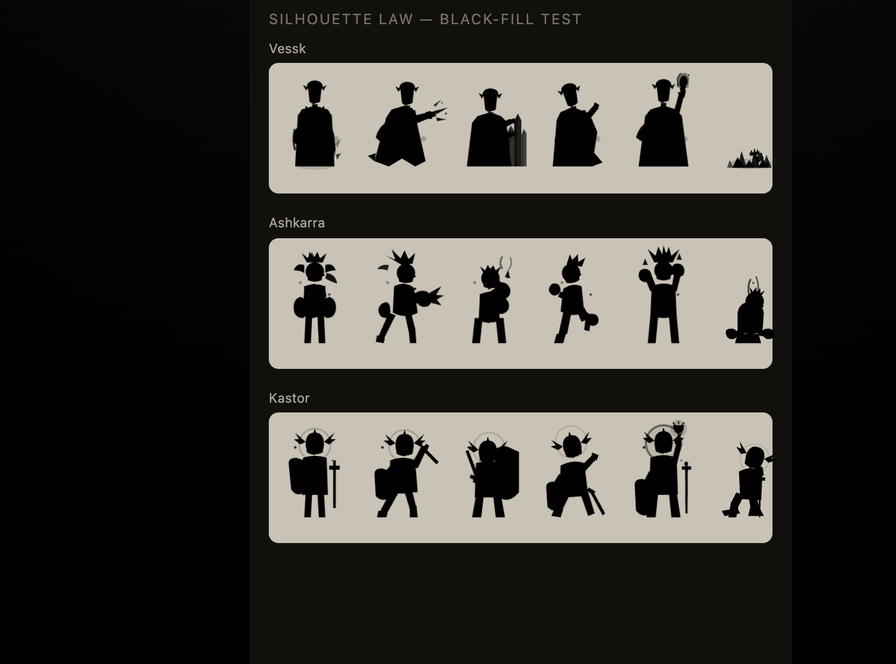
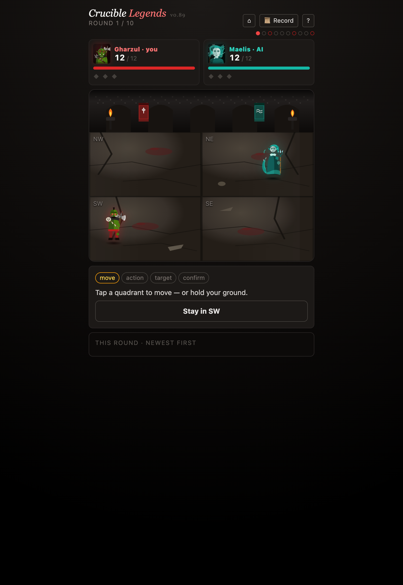
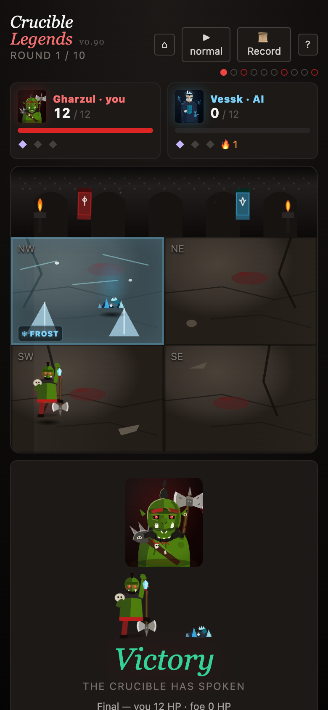
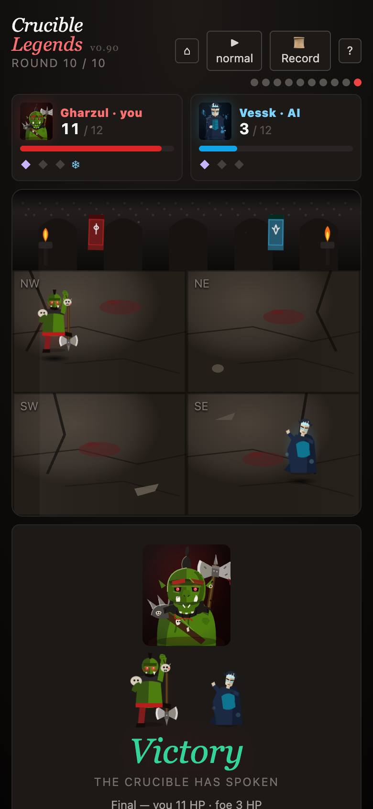
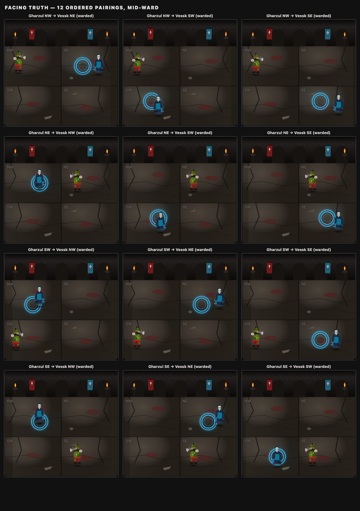
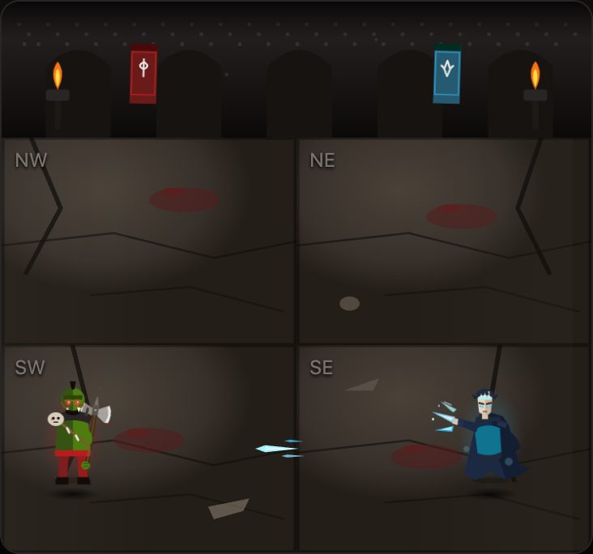
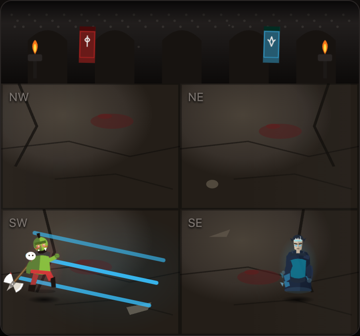
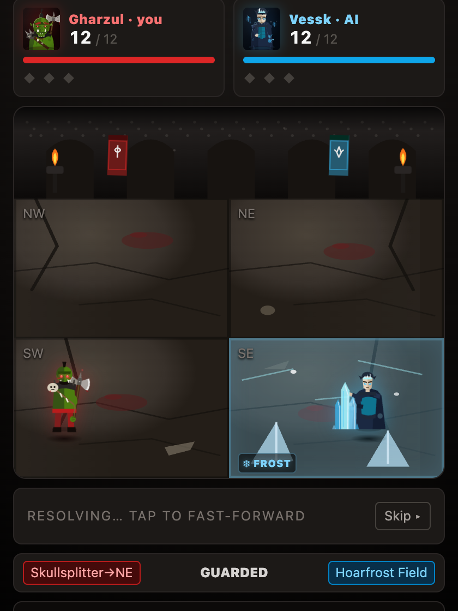
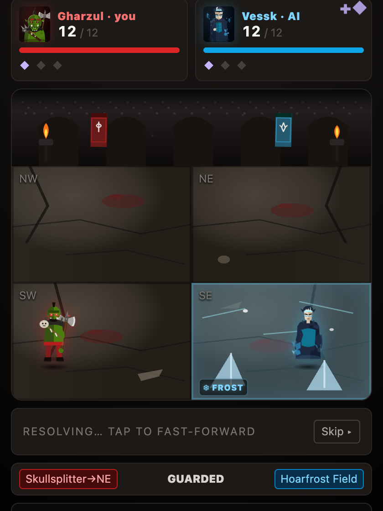
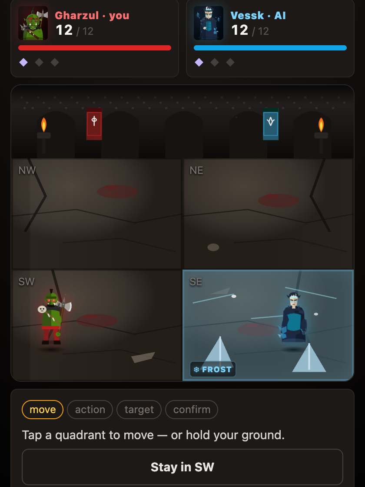

# Crucible Legends — Partner Brief (v0.91, July 2026)

*A plain-words tour of where the game stands, with the proofs to look at. Written for the design table.*

---

## Play it right now

- **The live game:** https://vzesty7.github.io/crucible-legends/
- **The living art gallery** (all twelve fighters, every pose, every forged weapon, the proof surfaces): https://vzesty7.github.io/crucible-legends/?artgallery
- **The design document** (the law — rules, roster, Art Bible, dated changelog of every decision): [bloodgrounds-design-v0-1.md](../bloodgrounds-design-v0-1.md)

The game auto-publishes from this repository: every change you see below is live.

---

## What shipped, version by version

| Version | What happened |
|---|---|
| v0.83 | **The Great Audit** — 413,000 simulated games verified every mechanic; five engine bugs found and fixed; first tier report filed |
| v0.84 | **The Five-Phase Rework** — doc truth pass (42 corrections), Koros rebuilt as the siege engine, AI v2 under World Doctrine, tutorials repaired, grand re-measure |
| v0.85–v0.85.4 | **Vessk: The Ice Architect** — frost zones, Ice Elementals, the mirror; shipped by designer ruling |
| v0.86 | **Class Conformance Pass** |
| v0.87 | **AI v3: The Mind** |
| v0.88 | **Art Pass I** — the Art Bible written into law; portrait depth on all twelve; the six-pose living board (72 drawings); idle life; permanent art-regression gate |
| v0.89 | **"Twelve True"** — the repair pass: eight new art laws, the Prop Forge (weapons drawn once, placed everywhere), every fighter's poses retold through their element, Gharzul's trophy system | 
| v0.90 | **Art Pass II: The Theater** — combat becomes a conducted sequence: one beat at a time, projectiles that travel, hitstop impacts, the Third Knock's infernal rending (fourth attempt), ceremonies, pacing controls |
| v0.91 | **Polish Pass I: True Endings & the Ranged Forge** — endings tell the truth (KO = a corpse, bell = beaten but standing; the trophy rack agrees); fighters always face their opponent; twelve named projectiles forged; the 60fps floor restored by fixing a real first-impact stutter |

Every entry has a full dated write-up in the design doc's changelog.

---

## The proofs, in viewing order

### The fighters (Art Pass I + Twelve True)

**The full gallery** — all twelve portraits, all seventy-two poses, the forged weapons with black-fill tests, Gharzul's trophy rack, true board-scale strips, mirrored-render proof, and silhouette strips:

**The silhouette law** — every fighter's six poses filled solid black must read as six different shapes:

**The living board in play:**

### True endings & the Ranged Forge (Polish Pass I)

**The Ranged Forge** — all twelve projectiles, in color and black-fill (each must be nameable by shape alone):

**The endings tell the truth** — a knockout leaves a corpse and raises the slain's trophy; a bell win leaves the loser standing, beaten, alive, and raises Gharzul's own totem instead:

(Full set: `ending-ko-p/ko-a/bell-p/bell-a-board/-ceremony.png` plus `ending-vigil-board.png` — Kastor's Undying Vigil never shows the death fall.)

**Facing truth** — twelve ordered position pairings, each mid-ward; the guard always leans toward the incoming enemy, never the wall:

**A projectile at true board scale** — Vessk's ice volley mid-flight, then breaking over Gharzul in Vessk's own cyan from the incoming side:

### The theater (Art Pass II)

One full round's choreography, frame by frame — reveal, strike, travel, impact, ward catch, ticks, income:

(The full set is `theater-beat-1.png` through `theater-beat-8.png` in this folder.)

### Wave-by-wave repair proofs (Twelve True)

- [Wave 1 poses](wave1-poses.png) · [Wave 1 weapons + trophy rack](wave1-weapons.png) · [Wave 1 silhouettes](wave1-silhouettes.png) · [board scale](wave1-boardscale.png) · [mirrored](wave1-mirror.png)
- [Wave 2 poses](wave2-poses.png) · [Wave 2 weapons](wave2-weapons.png) · [Wave 2 silhouettes](wave2-silhouettes.png) · [board scale](wave2-boardscale.png) · [mirrored](wave2-mirror.png)

---

## The written reports

- [The v0.82 migration & engine audit](audit-v0.82.md)
- [The v0.84 five-phase rework report](rework-v0.84.md) — before/after winrates for every fighter, verdicts on the named questions
- Raw data (tier tables, sweeps, matchups): [`reports/data/`](data/)

---

## How the game protects itself

Seventy-seven permanent tests gate every deploy. If any fails, the site does not publish. Highlights:

- **The art snapshot** — any change to any drawing fails the suite until deliberately approved
- **The seam test** — the same seeded game must end identically whether the round theater plays, is skipped, or runs instant (presentation can never touch outcomes)
- **The truth laws** (new in v0.91) — a bell ending renders zero corpses anywhere and the banner reads "Beaten," a knockout renders exactly one corpse per surface and reads "Slain," the trophy rack rises only on a kill, and all twelve position pairings face per the law
- **The death-beat guardrails** — a knockout lands in FALLEN, a bell loss shows HURT, Undying Vigil never triggers the death fall
- **Koros and Vessk kit guardrails** (13 + 28 rules pinned), **AI guardrails** (the new brain must out-pilot the old)
- **Performance law** (hardened in v0.91) — two assertions, both must pass: an absolute 60fps floor during the round theater on a mid-range phone profile, AND ≥90% of the measuring machine's own frame ceiling; gate definitions can never change without a dated designer-approved doc entry first
- **Reduced-motion law** — accessibility mode strips all animation and collapses the theater to instant

---

## Open items for the design table

1. **Balance watch list** (from the v0.87 measure): Dregan high (~68 MID), Zhal low (~27 MID); Maleth and Marrow flagged with him
2. **Class pool deviants**: Wrenna, Kastor, Dhoram still run flat 2/2/2 pools against their class doctrine
3. **Art Pass III candidates**: staged signature moments (Skyfall barrage, Ice Age births), stage art (Sunken Chapel / Ashpit / Rootbound Grove, §8 of the doc)
4. **Wrenna's kit** still wants printed numbers (the kiting AI lifted her, the kit didn't)

---

*Compiled July 12, 2026 · build v0.91 · suite 77/77 green · perf floor 60.4fps on the phone profile*
